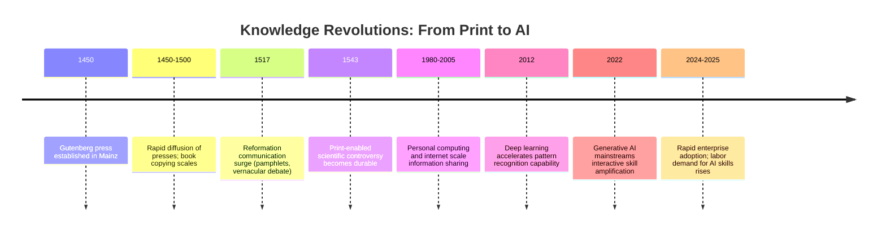
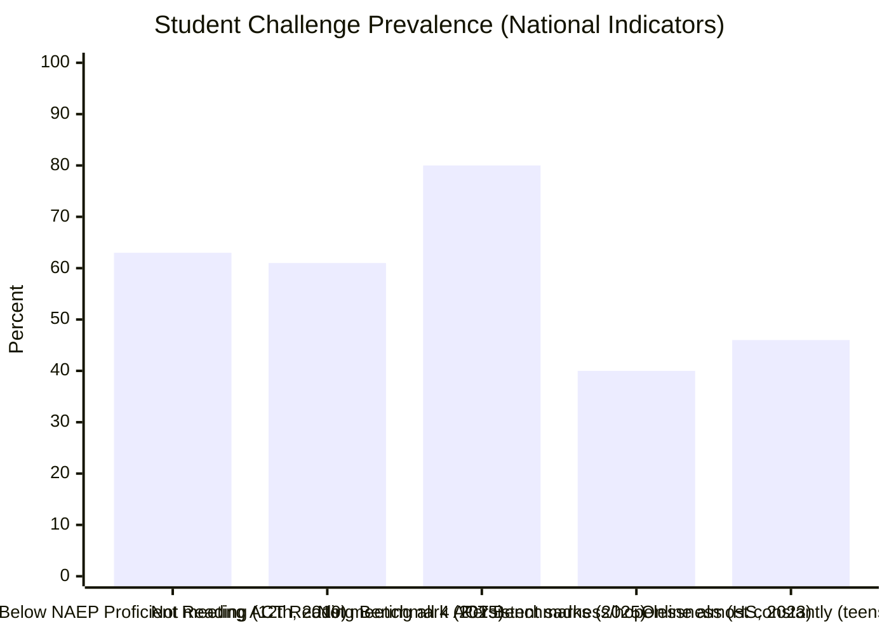
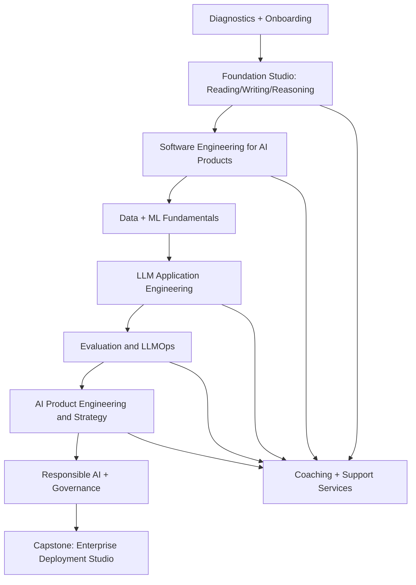

# Enterprise AI Degree Vision for the Second Renaissance

## Executive Summary

This report articulates a rigorous, research-grounded vision for an **Enterprise AI Degree** designed to prepare learners—traditional 18-year-old freshmen and non-traditional entrants alike—for an emerging labor market shaped by **AI-native work**. It argues that the current moment is best understood through a historical analogy: **the printing press catalyzed the Renaissance and the Reformation by dramatically lowering the cost of copying, distributing, and “stabilizing” knowledge; contemporary AI lowers the cost of producing, adapting, and applying skills.** This shift changes who can participate, how institutions maintain legitimacy, and what human contribution means in a world where cognitive output becomes cheaper and more abundant. citeturn25view1turn19view0turn28view1

Economically, the case rests on strong signals of demand for AI skills and role evolution. The entity["organization","Stanford HAI","ai research institute"] AI Index reports rising AI labor demand (e.g., U.S. AI-related job postings rising from 1.4% to 1.8% of all postings from 2023 to 2024) and rapid growth in generative AI as a skill cluster. citeturn10view0turn11view0turn11view1 Separately, entity["company","McKinsey & Company","management consulting firm"] estimates generative AI could create **$2.6T–$4.4T** in annual value across use cases, implying substantial organizational investment in AI-enabled productivity. citeturn2search2turn2search6 Meanwhile, the entity["organization","International Monetary Fund","un specialized agency"] estimates around **40% of global employment** is exposed to AI (about **60%** in advanced economies), suggesting both displacement risks and large-scale redesign of work. citeturn2search0turn2search4

Psychologically and academically, the program must confront the “incoming army” reality: national indicators show many students arrive with gaps in reading readiness and self-management alongside elevated mental-health and attention pressures. For example, NAEP grade 12 results show **37%** at/above “Proficient” in reading (2019), citeturn9view0turn0search4 and the entity["organization","ACT","us college admissions testing org"] national graduating-class profile reports only **39%** meeting the ACT Reading benchmark and **20%** meeting all four benchmarks in 2025. citeturn8view1turn8view2 The entity["organization","Centers for Disease Control and Prevention","us public health agency"] reports that **39.7%** of U.S. high school students experienced persistent sadness/hopelessness and **20.4%** seriously considered suicide (2023). citeturn6view1turn0search9 The entity["organization","Pew Research Center","us survey organization"] reports **46%** of U.S. teens are online “almost constantly” (2024). citeturn26view2turn26view0

The central program design choice is therefore **transformational education** rather than “content delivery”: a curriculum that combines rigorous software engineering and AI practice with coaching, communication remediation, and whole-person development. The program leverages your **Ordo multimodal system** (a program asset described here conceptually; product specifics are institution-defined) to present content through multiple modalities (text, diagrams, charts, generated examples), provide adaptive practice, and accelerate feedback loops—analogous to how printing scaled access to knowledge, but tuned for scaling **skills**. citeturn28view1turn25view1

Implementation details such as program length, cohort size, and tuition are **unspecified** and intentionally open-ended; the report instead emphasizes **measurable outcomes** (retention, competency mastery, portfolio readiness, job placement) and **governance mechanisms** to prevent institutional ossification.

## Historical and Philosophical Grounding

### Why the printing press is the right analogy

The printing press mattered historically not merely because it produced “more books,” but because it altered the **economics of knowledge**: replication became cheaper, distribution widened, and texts gained “fixity”—making comparisons, critique, and cumulative progress easier. entity["people","Elizabeth L. Eisenstein","historian of print culture"] famously framed print as an “agent of change,” emphasizing how a communications shift interacted with cultural and intellectual transformations. citeturn28view0turn28view1

Two modern empirical strands reinforce the analogy:

- entity["people","Jeremiah E. Dittmar","economist"] finds that European cities adopting printing early experienced significantly faster growth later (e.g., “60% faster” city growth from 1500–1600 in the QJE abstract), implying that information technology can produce long-run institutional and economic externalities rather than narrow sector effects. citeturn25view1turn25view0  
- entity["people","Jared Rubin","economist"] links printing to institutional change during the Reformation: using distance from Mainz as an instrument, he reports substantially higher probabilities of cities becoming Protestant when they had presses by 1500 (e.g., “52.1 percentage points” in his abstract and concluding synthesis). citeturn19view0turn18search10

These findings support a stronger claim than “technology helps ideas spread.” They support an institutional claim: **when the cost of reproducing and distributing symbolic goods collapses, authority structures dependent on scarcity and mediation come under pressure.** citeturn25view1turn19view0turn28view1

### The Renaissance and Reformation as institutional “power redistribution”

The Renaissance can be described as a broad reorientation toward classical knowledge, new forms of inquiry, and new cultural production. The Reformation can be described as a **reconfiguration of religious authority**—not the disappearance of religion, but a decentralization of interpretive control.

A key mechanism was that print **multiplied access** to texts and enabled a rapid pamphlet sphere. Scholarship notes that German-speaking lands were “awash” in pamphlets, that Reformation-era publications often blended text with images and oral-readability, and that diffusion depended on networks of literate opinion leaders as well as mass readership. citeturn29view0

This matters for your degree because AI is producing an analogous shift:

- Printing democratized access to **knowledge artifacts** (books, pamphlets, standardized references).  
- AI democratizes access to **productive capability**—drafting, coding, analysis, explanation, translation, design iteration—especially when coupled with structured workflows and evaluation. citeturn10view0turn11view2turn14search7

### A philosophical lens: knowledge democratization and human purpose when skills are abundant

Printing did not only change “what people knew”; it changed **who was allowed to know**, and therefore who was allowed to participate in shaping culture and institutions. entity["people","Benedict Anderson","political scientist"] argued that “print-capitalism” created new linguistic fixity and shared public discourse, enabling large-scale imagined communities and weakening older forms of trans-local authority rooted in a Latin clerisy. citeturn27view0

AI intensifies the same dynamic at the skill layer:

- When skill production becomes cheaper, the competitive edge shifts toward **judgment, ethics, purpose, taste, synthesis, and real-world deployment discipline**—the “why” and “what matters” that remain scarce even when “how to draft/prototype” becomes abundant. citeturn14search0turn14search7turn13view2  
- Institutions (including education) lose monopoly power if they rely primarily on transferring standardized knowledge. Their renewed legitimacy comes from **transformation**: coaching, community, credential trust, authentic assessment, and guiding learners to build durable human capabilities (communication, resilience, strategic thinking). citeturn15search1turn15search4turn16search5

Your enterprise AI degree vision fits this philosophical shift: it treats AI not as a replacement for education, but as the catalyst forcing education to become what it should have been—**a formation system for whole people**.

image_group{"layout":"carousel","aspect_ratio":"16:9","query":["Gutenberg printing press demonstration","15th century printing press woodcut","Protestant Reformation pamphlets woodcut","Renaissance printing shop"],"num_per_query":1}

### Suggested visual: historical parallels timeline

(Underlying evidence for print-era externalities and institutional change: citeturn25view1turn19view0turn28view1; for AI-era adoption and labor demand: citeturn10view0turn11view0turn10view1.)

### Table: historical parallels that justify the program thesis

| Dimension | Print-era shift | AI-era shift | Consequence for education |
| --- | --- | --- | --- |
| Cost curve | Copying texts becomes cheap relative to scribal labor citeturn25view1 | Producing drafts/code/analysis becomes cheap relative to human time citeturn14search7 | Schools can’t compete by “delivering information”; must certify judgment + practice |
| Access | Wider access to scripture, classics, references citeturn28view1 | Wider access to high-level cognitive assistance (tutoring, synthesis) citeturn10view1turn14search7 | More learners can attempt advanced production earlier |
| Authority | Competing interpretations weaken centralized control (Reformation) citeturn19view0turn29view0 | DIY learning + AI tools challenge credential gatekeeping citeturn15search3turn15search2 | Degrees must prove competence, not time-in-seat |
| New roles | Printers/publishers; pamphleteers; new public sphere citeturn29view0 | AI product engineers; forward-deployed AI engineers; evals/LLMOps roles citeturn12view0turn12view1turn13view0 | Curriculum must reflect end-to-end deployment work |
| Cultural outcome | Cumulative scholarship, standardized texts citeturn28view1 | Continuous iteration, evaluation harnesses, observability, governance citeturn13view2turn14search0 | Teach evaluation discipline + responsible deployment |

## Economic and Labor Market Rationale

### What’s changing in the labor market

Multiple reputable sources converge on three macro-patterns:

1. **Value creation and investment are moving toward AI-enabled workflows.** Generative AI’s potential value is estimated in the trillions annually, signaling durable adoption incentives rather than a passing trend. citeturn2search2turn2search10  
2. **Exposure is broad, not niche.** The IMF estimates ~40% of global employment is exposed to AI and ~60% in advanced economies, implying that “AI literacy” becomes general workforce infrastructure, while advanced building skills become high-leverage differentiators. citeturn2search0turn2search4  
3. **Demand for AI skills is observable in job postings.** The Stanford AI Index reports measurable growth in job postings requiring AI skills (e.g., U.S. rising from 1.4% to 1.8% of postings from 2023 to 2024) and identifies core specialized skills in AI postings (Python, computer science, data analysis, SQL, automation, cloud, agile/project management, scalability). citeturn11view0turn11view2turn11view1

### The roles that matter for your degree: AI-forward and AI-product engineering

Your program aligns with a family of roles that combine software engineering, product delivery, and applied AI systems building:

- **Forward-deployed / customer-facing AI engineer** (often called AI Forward Deployed Engineer, AI FDE, or Forward-Deployed Engineer Applied AI)
- **AI product engineer** (building LLM features into user-facing products, with evaluation and iteration loops)
- **Enterprise AI engineer** (deployment, governance, integration, observability, safety guardrails)

The distinguishing feature is **end-to-end ownership**: these roles are responsible for taking AI from prototype to production and measuring outcomes (quality, latency, reliability, safety, user adoption). citeturn12view1turn13view2turn12view3

### Concrete job description examples and the competencies they imply

The following examples are recent, publicly posted descriptions that illustrate the skill bundle your program must produce.

| Example role | Core responsibilities emphasized | Competency implications |
| --- | --- | --- |
| entity["company","Palantir Technologies","software company"] Forward Deployed AI Engineer | Own “Gen AI strategy and implementation” with customers; build “end-to-end workflows,” take them to production; collaborate with technical and non-technical stakeholders; strong ML basics and strong coding (Python/TS/Java/etc.). citeturn12view0 | Applied LLM workflow building; stakeholder discovery; production engineering; ML evaluation + decomposition; communication |
| entity["company","Databricks","data and ai company"] AI Engineer – FDE | Customer-facing delivery; build and productionize GenAI apps; experience with RAG, multi-agent systems, Text2SQL, fine-tuning; deploy production-grade GenAI including evaluation and optimizations; cloud deployment; communicate/teach across audiences. citeturn12view1 | RAG + agent systems; LLMOps; evaluation harnesses; cloud architecture; teaching/consulting communication |
| entity["company","Anthropic","ai safety company"] Forward Deployed Engineer, Applied AI | Embed with strategic customers; ship production apps; deliver artifacts like MCP servers, sub-agents, agent skills; evaluation frameworks; operate autonomously under ambiguity; strong customer discovery and communication. citeturn13view0 | Agentic systems; deployment patterns; autonomy; rigorous communication; reusable tooling mindset |
| entity["company","Accenture","professional services company"] Forward Deployed Engineer | Full AI lifecycle: fine-tuning, prompt engineering, system integration, deployment; build agent systems; apply evaluation methods for robustness/safety/fairness; production practices (CI/CD, tracing/logging, unit testing); RAG patterns. citeturn13view2 | Production-grade engineering + MLOps; eval discipline; responsible AI; system design; quality engineering |
| entity["organization","City and County of San Francisco","municipal government sf"] AI Product Engineer | Prototype and ship applied AI tools; build end-user apps surfacing RAG/LLM outputs “transparent and trustworthy”; iterate via pilots/feedback; balance innovation and safety; collaborate across retrieval pipelines and orchestration. citeturn12view2 | Human-centered AI; UI/UX for LLM outputs; transparency; rapid iteration; public-sector responsibility |
| entity["company","Tome","ai presentation software company"] AI Product Engineer | Work with product leaders to scope problems; optimize prompts; build RAG pipelines + agent architectures; improve quality (relevance/fidelity/latency) via empirical evaluation; high-velocity experimentation; modern web stack. citeturn12view3 | Product scoping; evaluation loops; latency/cost tradeoffs; full-stack AI product engineering |

**Takeaway:** the market is converging on a **hybrid professional**: a technically strong software engineer who can (a) build LLM systems, (b) evaluate and operate them, and (c) collaborate with humans to drive adoption and outcomes. Your degree is positioned precisely at this intersection. citeturn12view1turn13view0turn12view3

### Why non-traditional entrants are likely to succeed, not just survive

AI-era labor markets show increasing openness to skills-based hiring and alternative credential pathways, which strengthens your “accessibility” thesis:

- The entity["organization","National Association of Colleges and Employers","career services association"] reports **64.8%** of employers surveyed use skills-based hiring practices for new entry-level hires. citeturn15search0  
- entity["company","LinkedIn","professional networking platform"] argues skills-first approaches expand candidate pools for workers without bachelor’s degrees (reporting a 9% increase in candidate pools without degrees under skills-first filters). citeturn15search2turn15search6  
- entity["organization","UNESCO","un agency for education culture"] defines micro-credentials as records of “focused learning achievement verifying what the learner knows, understands or can do,” aligning with a competency-based assessment model rather than seat-time. citeturn15search1  
- entity["organization","OECD","intergovernmental economic organization"] reports growing interest in micro-credentials for lifelong learning and employability, while noting evidence and policy structures are still developing—an opportunity for well-designed “rigorous assessment + employer trust” models. citeturn15search4turn2search5

**Program implication:** Your enterprise AI degree can credibly recruit beyond traditional pipelines if it is built around **observable competencies**, portfolios, and trusted assessments—exactly what AI product/forward-deployed roles reward. citeturn12view1turn15search1turn15search4

## Incoming Freshmen Reality

### Academic readiness: reading and “college-ready comprehension” are not guaranteed

Two national indicators are especially relevant:

- NAEP grade 12 reading: the percentage of students at/above NAEP Proficient was **37%** (2019), with official cautions that NAEP Proficient is a demanding performance standard not identical to “grade-level proficiency.” citeturn9view0turn9view1  
- ACT national profile: for the graduating class of 2025, **39%** met the Reading benchmark, **50%** met English, and **20%** met all four benchmarks (English/Math/Reading/Science). citeturn8view1turn8view2

These figures imply that many freshmen will struggle with the high-volume reading and specification comprehension that enterprise AI engineering requires (e.g., interpreting requirements, writing clear technical docs, debugging based on logs, evaluating model outputs). citeturn12view1turn13view2turn8view1

### Attention and the “always-on” context

The dominant cognitive constraint for many students is not raw intelligence but **fragmented attention and low tolerance for deep work** in an always-on environment:

- Pew: **46%** of U.S. teens report being online “almost constantly,” and 96% report daily internet use (2024). citeturn26view2turn26view0  
- A recent meta-analysis of university students finds smartphone usage frequency has a small but statistically significant negative association with academic performance (r ≈ −0.12 across 45 studies). citeturn3search2

**Learning implication:** A program that assumes sustained attention without scaffolding will underserve the real population. AI makes this worse (constant novelty) and better (personalized coaching), depending on design choices. citeturn14search7turn3search2

### Mental health and emotional load

The degree must acknowledge that many learners arrive under substantial distress:

- CDC YRBS 2023: **39.7%** of high school students experienced persistent sadness/hopelessness; **28.5%** experienced poor mental health; **20.4%** seriously considered attempting suicide; **9.5%** attempted suicide. citeturn6view1  
- Early-college mental health remains a significant contextual factor; the Healthy Minds Study reports high prevalence of moderate-to-severe symptoms among college students (e.g., depression and anxiety measures), reinforcing the need for integrated support. citeturn2search15turn2search11

These realities directly affect cognition: stress and negative affect correlate with poorer academic outcomes and reduced persistence. citeturn16search12turn16search0

### Motivation and self-management: the hidden curriculum

Enterprise AI roles reward people who can plan, persist, iterate, and learn continuously. Many incoming students have not practiced these skills in a transferable way. Research on self-regulated learning (SRL) shows interventions can improve performance, strategy use, and motivation, implying that SRL should be taught explicitly rather than assumed. citeturn3search3turn3search11turn3search19

Motivation research grounded in self-determination theory indicates that supporting autonomy, competence, and relatedness improves motivation and engagement; SDT-based interventions show measurable benefits in educational settings. citeturn16search5turn16search17

### Suggested visual: prevalence of key challenges

(NAEP: citeturn9view0turn0search4; ACT: citeturn8view1turn8view2; CDC: citeturn6view1; Pew: citeturn26view2turn26view0)

### Table: student deficits versus program interventions

| Incoming challenge | Evidence signal | Likely impact on AI engineering learning | Program intervention |
| --- | --- | --- | --- |
| Reading comprehension gaps | NAEP grade 12 reading at/above Proficient 37% (2019) citeturn9view0; ACT reading benchmark met 39% (2025) citeturn8view1 | Misreading specs; brittle reasoning; weak documentation | Structured reading/writing studio; Ordo guided annotation + summarization; vocabulary expansion; technical writing rubrics |
| Fragmented attention | 46% of teens online “almost constantly” citeturn26view2 | Shallow practice; slow debugging skill; weak deep-work tolerance | Attention scaffolds: time-boxing, focus protocols, “single-problem deep dives,” device-aware policies; Ordo as guided practice environment |
| Mental health distress | CDC reports high prevalence of sadness/hopelessness and suicidal ideation citeturn6view1 | Dropout risk; diminished working memory and persistence | Embedded support: counseling referral pathways, coaching, belonging/community design; workload pacing with early wins |
| Low SRL/self-management | SRL interventions improve performance and motivation citeturn3search3turn3search11 | Inconsistent study habits; poor iteration and reflection | Explicit SRL curriculum: goal-setting, planning, reflection logs, accountability coaching |
| Low confidence/purpose | SDT meta-analytic evidence supports autonomy/competence/relatedness impact citeturn16search5turn16search17 | Disengagement; “why am I here?” | Mission-driven projects; mentoring; role models; frequent product demos and celebration of progress |

## Pedagogical Model and Curriculum Architecture

### Design principles for an AI-Renaissance degree

Your program vision implies five non-negotiable pedagogical commitments:

1. **Whole-person development**: technical excellence plus communication, vocabulary, strategy, and emotional resilience.  
2. **AI-native practice**: students learn to build with AI as infrastructure (RAG, evals, agents, tool use), not as a “cheat tool.” citeturn12view1turn13view2turn12view3  
3. **Multimodal instruction**: explanation through text + diagrams + examples + interactive critique to match diverse learner strengths (aligned with your Ordo system concept).  
4. **Project-based progression**: repeated cycles of build → evaluate → iterate → communicate results, mirroring real job expectations. citeturn12view3turn12view1  
5. **Competency-based assessment**: micro-credential-like mastery statements tied to demonstrable outcomes, aligning with skills-first hiring and micro-credential definitions. citeturn15search1turn15search0

### The Ordo multimodal system as “printing press for skills”

Historically, print scaled access to durable knowledge artifacts; your Ordo system scales access to **skill formation loops**: practice, feedback, revision, and perspective-shifting explanations. This directly matches how the AI Index describes modern AI work: iterative evaluation, tooling, and workflows rather than static knowledge. citeturn11view2turn13view2turn14search7

At a functional level (conceptual design), Ordo can serve as:

- **Multimodal explainer**: generate alternative explanations, diagrams, and examples for the same concept (e.g., RAG flow, vector search intuition).  
- **Communication coach**: rewrite student explanations at increasing sophistication; provide vocabulary ladders; critique structure and clarity.  
- **Deliberate practice engine**: produce targeted drills (unit tests, debugging exercises, evaluation rubric practice).  
- **Portfolio builder**: turn projects into structured write-ups and demos, training the skill of “showing your work” that job markets demand. citeturn12view0turn12view3

### Curriculum modules aligned to real job competencies

Below is a suggested modular architecture (exact sequencing and credit structure are unspecified and institution-defined). The key is that modules map explicitly to competencies in current job postings.

#### Suggested core module set

- **Foundation Studio: Reading, Writing, and Reasoning**  
  Technical reading, summarization, argument structure, professional writing, and presentation practice (paired with Ordo coaching).

- **Software Engineering for AI Products**  
  Version control, testing, APIs, data modeling, system design, security basics, observability.

- **Data + ML Fundamentals**  
  Practical statistics, evaluation thinking, ML basics, embeddings intuition, error analysis, reproducibility.

- **LLM Application Engineering**  
  Prompting and context engineering, RAG design, tool use, agent architectures, quality/latency tradeoffs.

- **Evaluation and LLMOps**  
  Eval harnesses, red-teaming basics, tracing/logging, monitoring, regression testing for prompts and retrieval, cost controls.

- **AI Product Engineering and Strategy**  
  User research, problem framing, adoption loops, ROI narratives, experimentation, stakeholder management.

- **Responsible AI, Governance, and Security**  
  Bias, transparency, risk frameworks, privacy and compliance constraints, human oversight.

- **Capstone: Enterprise Deployment Studio**  
  Industry or civic partner project with production deployment or production-grade simulation.

### Suggested visual: curriculum flowchart

### Table: curriculum modules mapped to market competencies

| Market competency cluster (from postings) | Evidence in postings | Curriculum module(s) that teach it | Mastery evidence (assessment artifacts) |
| --- | --- | --- | --- |
| RAG + retrieval pipelines | Emphasized in Databricks and SF roles citeturn12view1turn12view2; emphasized in Tome role citeturn12view3 | LLM Application Engineering; Data+ML Fundamentals | RAG service with eval report; hallucination/error analysis; retrieval quality metrics |
| Agent systems + tool use | Anthropic mentions sub-agents/agent skills citeturn13view0; Databricks mentions multi-agent systems citeturn12view1 | LLM Application Engineering; Evaluation and LLMOps | Agent workflow demo; tool-use reliability tests; safety constraints and fallbacks |
| Evaluation frameworks | Anthropic requires eval frameworks citeturn13view0; Accenture emphasizes eval for robustness/safety/fairness citeturn13view2 | Evaluation and LLMOps; Responsible AI | Evaluation harness; regression suite; red-team scenarios; monitoring dashboard |
| Production engineering | Palantir stresses taking workflows to production citeturn12view0 | Software Engineering for AI Products; Capstone | CI/CD pipeline; load tests; observability traces; incident postmortem simulation |
| Product framing + iteration | Tome emphasizes problem scoping + iteration citeturn12view3 | AI Product Engineering and Strategy | PRD + experiment plan; stakeholder demo; adoption metrics; iteration log |
| Responsible deployment | SF stresses trustworthy, transparent tools citeturn12view2; Accenture emphasizes safety/fairness citeturn13view2 | Responsible AI + Governance | Model/system risk register; governance checklist; transparency UX patterns |

### Assessment metrics that matter

To align with skills-first hiring and to avoid “credential inflation,” assessments should be tangible and cumulative:

- **Literacy/communication growth**: baseline-to-term improvements in technical reading comprehension, writing clarity, and presentation performance (rubric-based).  
- **Engineering quality**: automated test coverage, code review rubric scores, API correctness, documentation completeness.  
- **AI system quality**: eval harness performance, error taxonomy quality, latency/cost budgets, and monitoring readiness. citeturn13view2turn12view1turn12view3  
- **Professional readiness**: portfolio completeness, demo effectiveness, stakeholder communication, collaboration reliability.

## Implementation and Measurable Outcomes

### Recruitment strategy

Because the labor market is trending toward skills-first signals and micro-credentials, recruitment can target both traditional and non-traditional populations:

- **Traditional:** high school graduates attracted by clear job targets (AI-forward engineer, AI product engineer).  
- **Non-traditional:** career changers, veterans, working adults—especially strong candidates who can benefit from structured competency validation. Skills-based hiring prevalence supports the plausibility of these pathways. citeturn15search0turn15search2

A practical recruitment message consistent with the “Second Renaissance” framing is: **“We don’t just teach AI—we rebuild your capacity to read, write, reason, and build.”**

### Student support services as core infrastructure

Given the mental-health and attention context, support cannot be an afterthought:

- Embedded coaching aligned to SRL practices (goal setting, planning, reflection). citeturn3search19turn3search3  
- Belonging/community design to improve persistence; student belonging is associated with retention and academic outcomes in higher-ed contexts. citeturn16search10turn16search18  
- Clear pathways to counseling/clinical support for high-need students (informed by CDC prevalence signals). citeturn6view1

### Industry partnerships: make the market part of the curriculum

To keep the program from drifting into academic irrelevance, partnerships should be structural:

- An industry advisory group that reviews capstones and competency rubrics every term (or equivalent cycle).  
- Co-designed project briefs with real constraints (latency, cost, governance), mirroring job postings’ emphasis on production readiness. citeturn12view1turn13view2  
- Internship/co-op pipelines, including “micro-internships” for non-traditional learners balancing work/family.

### Table: measurable outcomes and metrics

| Outcome | Why it matters | Example measurement approach | Target setting guidance |
| --- | --- | --- | --- |
| Retention and progression | Indicates program’s transformational capacity amid mental-health pressures | Term-to-term retention; credit completion; SRL participation | Set improvement targets relative to institutional baseline; track subgroup equity |
| Competency mastery | Proves degree is skills-valid, not seat-time | Competency badges; rubric + artifact review; external reviewer audits | Tie to job competency map; require capstone-level integration |
| Portfolio quality | Hiring currency for AI product roles | Number and quality of deployed demos; documentation; eval reports | Require at least one “production-grade simulation” project |
| Job placement and role fit | Validates market alignment | Placement rate; role category; time-to-offer | Segment by role type (AI product vs. AI FDE vs. SWE AI) |
| Communication improvement | Converts literacy gaps into professional strength | Writing and presentation rubrics; stakeholder demo scores | Expect measurable gains from baseline diagnostics |
| Responsible AI readiness | Mitigates governance and safety risk in practice | Risk registers; eval transparency; compliance checklists | Align with NIST AI RMF categories and generative AI profile citeturn14search0turn14search7 |

## Risks, Ethics, and Preventing Institutional Ossification

### AI risk is real: bias, safety, hallucinations, and governance

Your program’s credibility depends on treating responsible AI as a technical discipline, not an elective.

- entity["organization","National Institute of Standards and Technology","us standards agency"] AI RMF 1.0 frames AI risks and trustworthiness as socio-technical, emphasizing context, measurement, and governance across the AI lifecycle. citeturn14search0turn14search3  
- NIST’s generative AI profile extends RMF concepts toward GenAI-specific risks and controls (evaluation, monitoring, documentation) and was developed in the policy context of EO 14110. citeturn14search7turn14search4  
- Regulatory pressure is rising internationally; the entity["organization","European Union","political and economic union"] describes the AI Act as a risk-based legal framework addressing AI risks, signaling a compliance-aware future for many deployers. citeturn14search5

**Program implication:** Teaching evaluation frameworks, monitoring, and governance is not optional; it is part of employability for enterprise contexts. citeturn13view2turn14search7

### Equity risks: AI can widen gaps if access and pedagogy are weak

The same technology that democratizes skills can amplify inequality if:

- students lack stable access to devices/connectivity,  
- core literacy isn't supported, or  
- assessments reward prior privilege rather than growth.

Your Ordo system and coaching design should therefore be explicitly equity-oriented: multimodal explanations, scaffolding, and transparent competency rubrics can narrow gaps—if paired with support and community design. citeturn26view0turn12view2

### Credentialing risk: degrees can become the new “clerisy” if they fossilize

The printing press era produced both democratization and new gatekeepers (publishers, censors, elites). Similarly, AI-era education risks becoming another centralized gatekeeping apparatus if it ossifies around outdated tools or prestige signals.

Countermeasures supported by the micro-credential and skills-first trends:

- Maintain competency definitions that match real hiring signals and update them termly. citeturn15search0turn15search4  
- Use transparent, portable mastery statements aligned with UNESCO’s micro-credential definition. citeturn15search1  
- Preserve external validation loops (industry reviewers, capstone juries).

### Institutional anti-ossification mechanisms

To avoid becoming the “Church before the Reformation” in your own analogy, bake in governance that assumes continual change:

- **Curriculum versioning:** publish “vX.Y” competency maps; retire modules explicitly.  
- **Red-team curriculum:** require students and faculty to critique program outputs and propose improvements (mirrors GenAI red-teaming culture). citeturn14search7turn14search4  
- **Advisory board accountability:** annual public outcomes report (retention, placement, competency distributions).  
- **Tool-agnostic principles:** teach durable abstractions (evaluation, system design, human-centered delivery) so tool churn doesn’t break the degree.

---

### Closing thesis

The Renaissance analogy is not rhetorical decoration; it is a strategic design constraint. The printing press didn’t simply “add books”—it **restructured the political economy of knowledge** and shifted institutional legitimacy toward those who could help people interpret, apply, and live with abundance. citeturn28view1turn27view0turn19view0

AI is restructuring the political economy of **skills**. Your enterprise AI degree is strongest when framed not as “training coders,” but as building an institution designed for this new abundance: **a formation system that produces AI-native builders who can read, write, reason, evaluate, deploy, and lead—whole people capable of participating in the new AI Renaissance.** citeturn12view1turn13view2turn10view1
