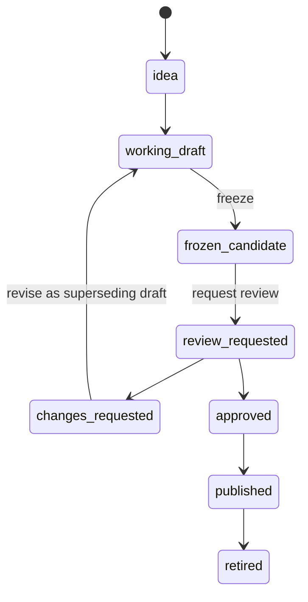
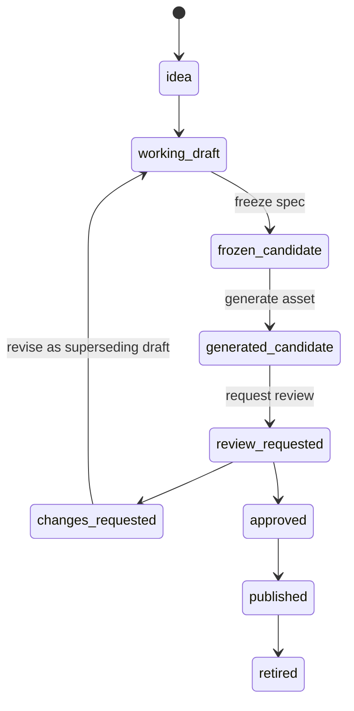
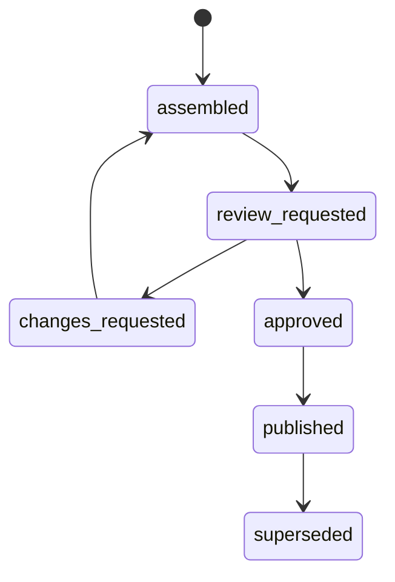

# Workflow State Machine Spec

## Purpose

Define the draft, freeze, review, revise, approve, and publish workflow for content, visuals, and releases.

The workflow should support repeated review and resolution cycles while preserving a durable audit trail.

## Workflow doctrine

1. Workflow state lives in files and manifests, not in chat history.
2. Review is an artifact, not a mood.
3. Working drafts may be mutable.
4. Append-only guarantees begin at the frozen-candidate boundary.
5. Approval is explicit.
6. Publishing only happens from approved artifacts.

## Artifact types governed by the workflow

- `UnitDraft`
- `UnitVersion`
- `VisualDraft`
- `VisualSpecVersion`
- `ReleaseManifest`
- `ReviewRecord`

## Unit workflow

### Lifecycle

### State meanings

- `idea`: a unit concept exists but no draft artifact has been created.
- `working_draft`: a mutable authoring file exists and can still be edited.
- `frozen_candidate`: an immutable version snapshot has been created from the working draft.
- `review_requested`: the frozen snapshot is awaiting review.
- `changes_requested`: review findings require a superseding draft and snapshot.
- `approved`: the current snapshot passed review and can be referenced by a release manifest.
- `published`: the approved snapshot appears in a published release.
- `retired`: the unit no longer appears in future releases.

### Important boundary

Only `working_draft` is mutable.

Once a unit becomes `frozen_candidate`, it must never be edited in place. Any change after that point must happen through a new working draft and a new superseding version snapshot.

## Visual workflow

### Lifecycle

### State meanings

- `idea`: a visual need has been identified.
- `working_draft`: a mutable visual spec draft exists.
- `frozen_candidate`: an immutable visual-spec snapshot exists.
- `generated_candidate`: the frozen spec has produced assets or deterministic outputs.
- `review_requested`: the generated candidate is awaiting review.
- `changes_requested`: the candidate failed review and a superseding draft is required.
- `approved`: the current visual version is acceptable for release use.
- `published`: the visual appears in a published release.
- `retired`: the visual is no longer active in future releases.

## Release workflow

### Lifecycle

### State meanings

- `assembled`: a candidate release manifest exists.
- `review_requested`: the candidate manifest is under review.
- `changes_requested`: the release contains invalid, missing, or unapproved references.
- `approved`: the release is ready to publish.
- `published`: the release is live.
- `superseded`: a newer release replaced it.

## Review roles

Each review record should declare a role so the workflow can support targeted passes.

Recommended roles:

- `editorial`
- `pedagogy`
- `accuracy`
- `design`
- `accessibility`
- `visual`
- `release`

## Review record requirements

Every review pass must create a review record with:

- target artifact
- target version
- reviewer role
- findings with severity
- outcome
- requested next step

Recommended outcomes:

- `approved`
- `changes_requested`
- `blocked`

## Revision model

When a review requests changes:

1. Do not edit the reviewed version in place.
2. Create or reopen a working draft based on the reviewed version.
3. Freeze a new superseding candidate version.
4. Request review again.

This loop may repeat as many times as needed until approval is explicit.

## Workflow invariants

1. Working drafts may never appear in a release or production build.
2. Only approved version snapshots may appear in a release.
3. Only published releases may drive production builds.
4. A release may not reference unpublished or retired visual versions.
5. A review record may not be deleted once created.
6. A retired artifact may remain in historical releases but not in new ones unless explicitly reintroduced through a new version.

## Failure modes to prevent

- reviewing content without producing a record
- revising a frozen candidate in place
- publishing unreviewed visuals because the page looked finished
- building from a working draft or implicit latest draft instead of an approved release manifest
- losing the lineage between a reviewed version and the superseding draft that addresses it

## Acceptance criteria

- The workflow supports repeated review and revision cycles.
- The mutation boundary between working drafts and immutable snapshots is explicit.
- The state of units, visuals, and releases is machine-readable.
- Every publish action can be traced back to approved artifacts.
- The model preserves complete historical lineage.